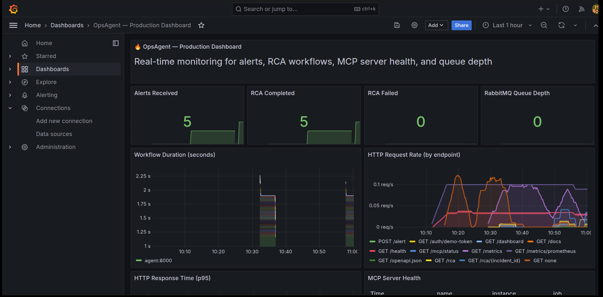
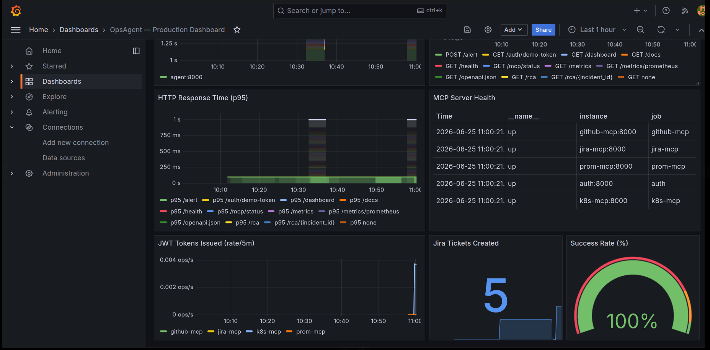
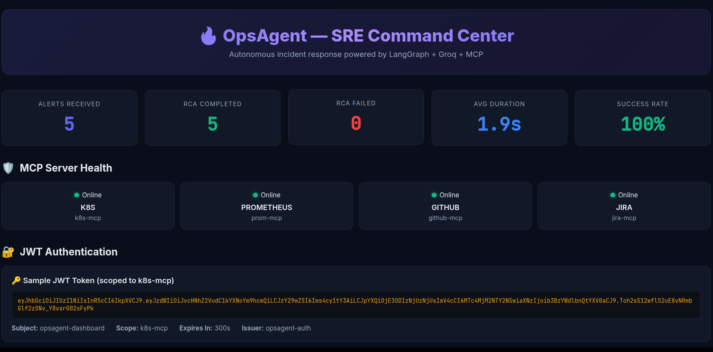
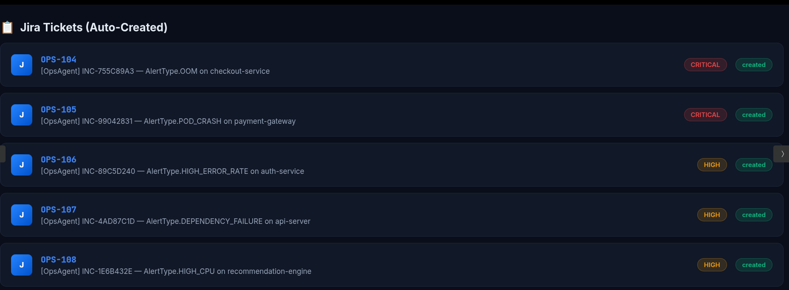
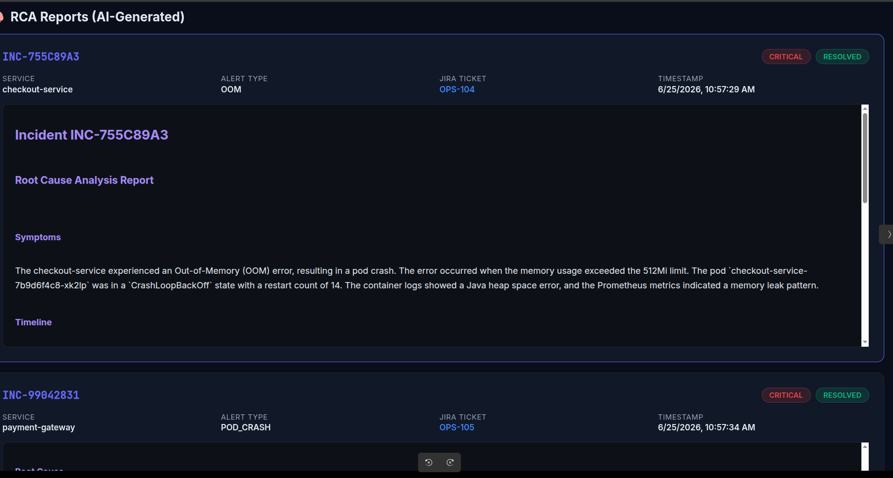
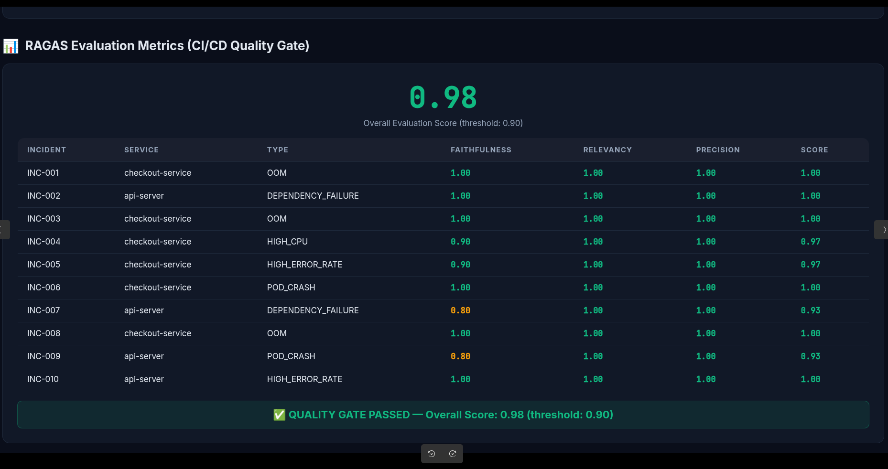
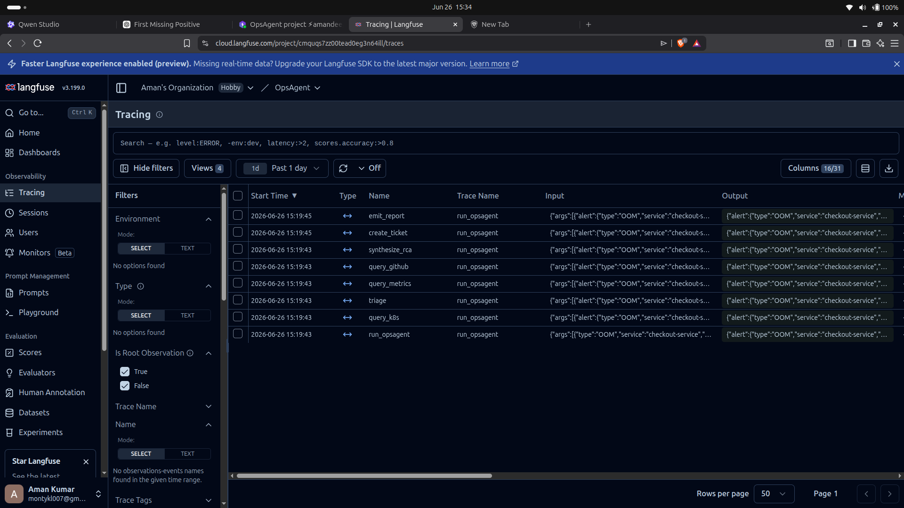
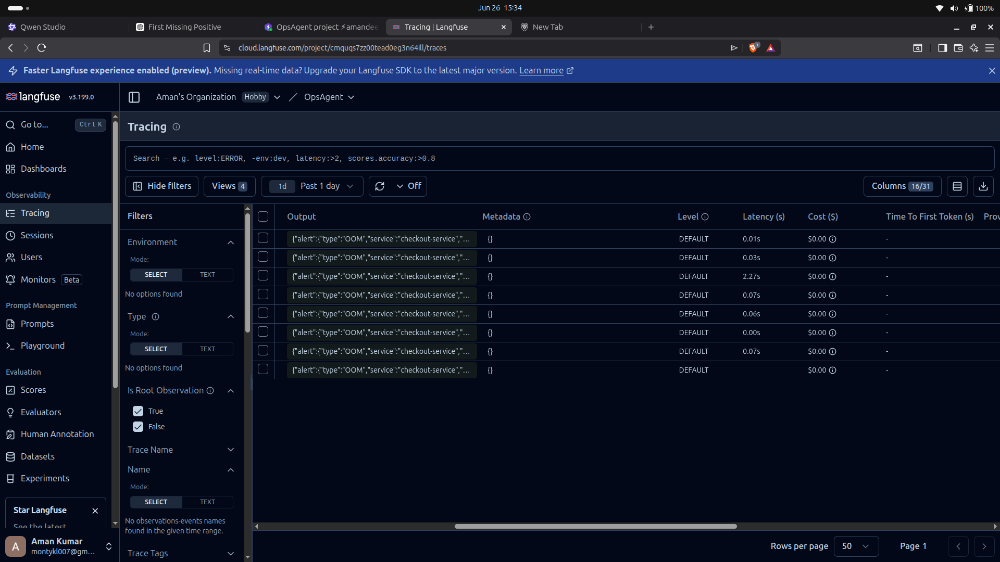

<div align="center">

#  OpsAgent — Autonomous SRE Fabric

**An AI-powered Site Reliability Engineer that autonomously diagnoses infrastructure incidents using the Model Context Protocol (MCP).**

[](https://github.com/Aman-28-tech/ops-agent/actions)


[Architecture](#architecture) • [Quick Start](#quick-start) • [How It Works](#how-it-works) • [MCP Servers](#mcp-servers-data-layer) • [Production Features](#production-features) • [Evaluation](#llm-evaluation-pipeline) • [CI/CD](#cicd-pipeline) • [API Reference](#api-reference)

</div>

---

## Screenshots

### 📊 Grafana — Production Monitoring
> Real-time Prometheus metrics: alert rates, workflow duration, MCP health, and success rate.




### 🖥️ SRE Command Center (Web Dashboard)
> Built-in visual dashboard at `/dashboard` — RCA reports, Jira tickets, JWT tokens, and eval metrics in one view.



### 📋 Auto-Created Jira Tickets
> Every RCA automatically creates a tracked Jira ticket with full context.



### 🧠 AI-Generated RCA Report
> Autonomous root cause analysis with timeline, symptoms, and remediation steps.



### 📊 LLM Evaluation Metrics
> CI/CD quality gate scoring Faithfulness, Answer Relevancy, and Context Precision.



### 🔍 Langfuse Observability (Tracing & Token Costs)
> End-to-end tracing of the LangGraph agent, showing every MCP call, LLM prompt, and token cost calculation.




---

## The Problem

When a server crashes at 3 AM, human SREs have to:
1. Wake up and check Kubernetes pod status
2. Dig through container logs
3. Query Prometheus for metric anomalies
4. Scan recent GitHub commits for suspicious changes
5. Correlate all of this manually to find the root cause
6. Create a Jira ticket and write up the incident report

**OpsAgent does this autonomously in seconds.**

## The Solution

The moment a critical alert fires (OOM, pod crash, high error rate), OpsAgent:
- Authenticates via **JWT tokens** scoped per MCP server
- Securely connects to **4 isolated MCP servers** (K8s, Prometheus, GitHub, Jira)
- Collects pod status, container logs, time-series metrics, and recent commits
- Correlates cross-platform signals using an **LLM-powered LangGraph agent**
- Generates a structured **Root Cause Analysis (RCA)** report
- **Auto-creates a Jira ticket** with the full RCA
- Processes alerts via **RabbitMQ** for at-scale reliability
- Exposes **Prometheus metrics** visualised in a **Grafana dashboard**
- Traces every step via **Langfuse** for full observability

---

## Architecture

```
┌──────────────────────────────────────────────────────────────────────────┐
│                         ALERT WEBHOOK                                    │
│               (PagerDuty / Opsgenie / curl)                              │
└──────────────────────┬───────────────────────────────────────────────────┘
                       │
                       ▼
              ┌────────────────┐
              │   RabbitMQ     │  ← Alert queue (at-scale ingestion)
              │   Alert Queue  │
              └────────┬───────┘
                       │
                       ▼
┌──────────────────────────────────────────────────────────────────────────┐
│                   AGENT ORCHESTRATOR                                      │
│             FastAPI + LangGraph StateGraph                                │
│                                                                          │
│  ┌────────┐ ┌──────────┐ ┌───────────┐ ┌───────────┐ ┌──────────────┐  │
│  │Triage  │→│Query K8s │→│Query Prom │→│Query GitHub│→│Synthesize RCA│  │
│  └────────┘ └──────────┘ └───────────┘ └───────────┘ └──────┬───────┘  │
│                                                              │           │
│                                                              ▼           │
│                                                   ┌──────────────────┐   │
│                                                   │  Create Ticket   │   │
│                                                   │  (Jira MCP)     │   │
│                                                   └──────────────────┘   │
│                                                              │           │
│                               Langfuse Tracing ◄─────────────┘           │
└────┬──────────────┬──────────────┬──────────────┬────────────────────────┘
     │ JWT + MCP    │ JWT + MCP    │ JWT + MCP    │ JWT + MCP
     ▼              ▼              ▼              ▼
┌──────────┐ ┌──────────┐ ┌──────────┐ ┌──────────┐
│ K8s MCP  │ │Prom MCP  │ │GitHub MCP│ │Jira MCP  │
│ Server   │ │Server    │ │Server    │ │Server    │
│          │ │          │ │          │ │          │
│• pod_stat│ │• cpu     │ │• commits │ │• create  │
│• logs    │ │• memory  │ │• pr_diff │ │• get     │
│• restart │ │• errors  │ │• risk    │ │• list    │
└────┬─────┘ └────┬─────┘ └────┬─────┘ └────┬─────┘
     │            │            │            │
     ▼            ▼            ▼            ▼
Kind Cluster  Prometheus   GitHub API    Jira Cloud
(live/mock)   (local)      (scoped PAT)  (API token)

         ┌─────────────────────────┐
         │   AUTH SERVICE (JWT)    │  ← Short-lived, scoped tokens
         │   POST /auth/token     │
         │   POST /auth/verify    │
         └─────────────────────────┘

         ┌─────────────────────────┐
         │ MONITORING STACK        │
         │ Prometheus → Grafana    │  ← Real-time dashboards
         │ /metrics/prometheus     │
         └─────────────────────────┘
```

### Key Design Decisions

| Decision | Why |
|---|---|
| **MCP abstraction** | Security-by-design — the LLM never touches raw credentials. Each MCP server is an isolated microservice with its own auth boundary. |
| **JWT per MCP** | Short-lived tokens scoped to individual MCP servers. The agent requests a fresh JWT before each call, logged in Langfuse. |
| **RabbitMQ queue** | Decouples alert ingestion from processing. Enables horizontal scaling (N consumers), at-least-once delivery, and back-pressure handling. |
| **LangGraph StateGraph** | Clean separation of workflow steps. Each node is independently testable and traceable. |
| **Grafana + Prometheus** | Real-time visibility into alert rates, workflow duration, MCP health, and success rates. |
| **Jira auto-ticketing** | Closes the incident lifecycle — every RCA automatically creates a tracked ticket. |
| **Langfuse tracing** | Every MCP hop, JWT fetch, LLM call, and token cost is logged. Full decision-path visibility. |
| **CI/CD quality gate** | Non-deterministic AI output is gated on Faithfulness, Relevancy, and Context Precision scores. PR is blocked if accuracy < 0.90. |
| **Retry + circuit breaker** | `tenacity` exponential backoff + `pybreaker` circuit breaker on all MCP calls. Graceful degradation when a service is down. |

---

## Quick Start

### Prerequisites

- Docker ≥ 24.0
- Docker Compose ≥ 2.20
- A Groq API key (free at https://console.groq.com/keys)

### 1. Clone & configure

```bash
git clone https://github.com/Aman-28-tech/ops-agent.git
cd ops-agent
cp .env.example .env
# Edit .env and add your GROQ_API_KEY (free at console.groq.com)
```

### 2. One-click start

```bash
chmod +x setup.sh && ./setup.sh
```

Or using Make:

```bash
make up
```

### 3. Access the dashboards

| Service | URL | Credentials |
|---|---|---|
| **SRE Command Center** | http://localhost:8000/dashboard | — |
| Agent API (Swagger) | http://localhost:8000/docs | — |
| Grafana | http://localhost:3000 | admin / opsagent |
| Prometheus | http://localhost:9090 | — |
| RabbitMQ | http://localhost:15672 | guest / guest |

### 4. Fire a synthetic alert

```bash
curl -X POST http://localhost:8000/alert \
  -H "Content-Type: application/json" \
  -d '{"type":"OOM","service":"checkout-service","description":"Memory exceeded limit"}'
```

### 5. Check the results

```bash
# View agent metrics (JSON)
curl http://localhost:8000/metrics | python3 -m json.tool

# View Prometheus metrics
curl http://localhost:8000/metrics/prometheus | head -20

# View MCP tool discovery
curl http://localhost:8001/mcp/tools/list | python3 -m json.tool

# View MCP server connectivity
curl http://localhost:8000/mcp/status | python3 -m json.tool

# Get a JWT token
curl -X POST http://localhost:8010/auth/token \
  -H "Content-Type: application/json" \
  -d '{"client_id":"opsagent","scope":"k8s-mcp"}'
```

---

## How It Works

### 1. Alert Ingestion
A webhook `POST /alert` accepts alerts in PagerDuty/Opsgenie format. If RabbitMQ is available, the alert is published to a durable queue. Otherwise, falls back to in-process execution.

### 2. LangGraph Workflow
The agent executes a 7-node StateGraph:

| Node | Action | MCP Server |
|---|---|---|
| `triage` | Parse alert, assign incident ID | — |
| `query_k8s` | Get pod status + container logs | K8s MCP |
| `query_metrics` | Get CPU/memory time-series + anomaly detection | Prometheus MCP |
| `query_github` | Get recent commits + PR diff + risk analysis | GitHub MCP |
| `synthesize_rca` | Feed all context to LLM → structured RCA | — |
| `create_ticket` | Auto-create Jira issue from RCA report | Jira MCP |
| `emit_report` | Log + persist the final report | — |

### 3. RCA Output
The LLM generates a structured report with:
- **Symptoms** — What was observed (pod status, error codes)
- **Timeline** — Sequence of events with timestamps
- **Root Cause** — The specific commit/change that caused the issue
- **Remediation** — Actionable steps to fix it

A Jira ticket is automatically created with the full report.

---

## Production Features

### 🔐 JWT Authentication
Every MCP call is authenticated with a short-lived JWT token:
1. Agent requests a token from the Auth service, scoped to the target MCP
2. Auth service issues a JWT with 5-minute TTL
3. MCP server validates the token's signature and scope
4. Tokens are cached client-side with a 30-second expiry buffer

```bash
# Request a scoped JWT
curl -X POST http://localhost:8010/auth/token \
  -H "Content-Type: application/json" \
  -d '{"client_id":"opsagent","scope":"k8s-mcp"}'
```

### 🐰 RabbitMQ Alert Queue
Alerts are published to a durable RabbitMQ queue for reliable, scalable processing:
- **At-least-once delivery** — messages ACK'd only after RCA completes
- **Horizontal scaling** — `docker compose up -d --scale consumer=3`
- **Back-pressure handling** — RabbitMQ buffers alert bursts
- **Fair dispatch** — `prefetch_count=1` prevents consumer overload

### 📊 Grafana Dashboard
Pre-provisioned dashboard with 12 panels:
- Alerts received / RCA completed / RCA failed counters
- Workflow duration time-series
- HTTP request rate and p95 response time
- MCP server health table
- RabbitMQ queue depth
- JWT tokens issued rate
- Jira tickets created counter
- Success rate gauge

### 🎫 Jira Auto-Ticketing
Every successful RCA automatically creates a Jira ticket:
- Priority is set based on alert type (OOM/POD_CRASH → Critical)
- Labels include `opsagent`, `auto-rca`, and the alert type
- Full RCA markdown is attached as the ticket description
- Ticket key and URL are included in the workflow state

### ☸️ Live Kubernetes Support
Set `K8S_SANDBOX_MODE=live` to connect to a real Kind cluster:
- Reads pods, logs, and deployments via the official Kubernetes Python client
- Supports both in-cluster and kubeconfig authentication
- Graceful fallback to mock mode if K8s client initialization fails

---

## MCP Servers (Data Layer)

Each MCP server follows a standard protocol with two endpoints:

| Endpoint | Method | Description |
|---|---|---|
| `/mcp/tools/list` | `GET` | Tool discovery — returns all available tools with parameter schemas |
| `/mcp/tools/call` | `POST` | Tool execution — runs a tool and returns structured results |

All MCP endpoints are protected by JWT authentication.

### Kubernetes MCP (port 8001)
| Tool | Description |
|---|---|
| `get_pod_status` | Pod status, restart count, exit code, resource limits |
| `fetch_container_logs` | Most recent container log lines |
| `restart_deployment` | Rolling restart of a deployment |
| `list_pods` | All pods in the cluster |

### Prometheus MCP (port 8002)
| Tool | Description |
|---|---|
| `query_cpu_usage` | CPU time-series with anomaly detection |
| `query_memory_spikes` | Memory time-series with leak analysis |
| `query_error_rate` | HTTP 5xx error rate vs. baseline |

### GitHub MCP (port 8003)
| Tool | Description |
|---|---|
| `get_recent_commits` | Recent commits with changed files and author info |
| `fetch_pr_diff` | Latest merged PR with diff, review status, and risk analysis |

### Jira MCP (port 8004)
| Tool | Description |
|---|---|
| `create_ticket` | Create a Jira issue from RCA data |
| `get_ticket` | Retrieve a ticket by key |
| `list_tickets` | List recent tickets for a service |

Each server has a full [OpenAPI 3.1 specification](mcp/) for contract-first development.

---

## LLM Evaluation Pipeline

The evaluation layer scores every generated RCA against ground-truth data from [`mock_incidents.json`](mock_incidents.json) (10 incidents).

### Metrics

| Metric | What it measures |
|---|---|
| **Faithfulness** | Did the LLM hallucinate data not present in the MCP context? |
| **Answer Relevancy** | Is the RCA structured correctly and relevant to the alert type? |
| **Context Precision** | Did the RCA cite the correct commit SHA and service name? |

### Running locally

```bash
python evaluation/eval.py --threshold 0.90
```

Output:
```
══════════════════════════════════════════════════════════════
  OpsAgent LLM Evaluation Pipeline
  Threshold: 0.90  |  Incidents: 10
══════════════════════════════════════════════════════════════

  ✅ INC-001 (                 OOM) F=1.00 R=0.97 P=1.00 => 0.99
  ✅ INC-002 (  DEPENDENCY_FAILURE) F=1.00 R=0.95 P=1.00 => 0.98
  ...

──────────────────────────────────────────────────────────────
  Overall Score: 0.9680  |  Threshold: 0.90
──────────────────────────────────────────────────────────────

  ✅ PASSED — Score 0.9680 >= threshold 0.90
```

---

## Testing

### Unit Tests (no Docker needed)

Unit tests run entirely locally with no infrastructure dependencies. Install the agent dependencies first:

```bash
cd ops-agent/agent
pip install -r requirements.txt
```

Then run all tests:

```bash
python -m pytest tests/ -v --tb=short
```

Or use Make from the `ops-agent/` directory:

```bash
make test
```

### Test Suite Coverage

| Test File | What it tests | Count |
|---|---|---|
| `test_api.py` | FastAPI routes (`/health`, `/metrics`, `/alert`, `/rca`) | 9 tests |
| `test_mcp_client.py` | MCP client init, health, tool discovery, async bridge | 7 tests |
| `test_workflow.py` | Triage node (incident ID, service extraction, uniqueness) | 5 tests |
| `test_eval.py` | Evaluation scoring functions (faithfulness, relevancy, precision) | 10 tests |
| `test_auth.py` | Auth service JWT (issuance, verification, scope validation) | 6 tests |
| `test_mcp_servers.py` | K8s MCP server tools (pod status, logs, tool dispatch) | 7 tests |

### LLM Evaluation (no Docker needed)

```bash
cd ops-agent
python evaluation/eval.py --threshold 0.90
```

### Integration Tests (requires Docker)

The full integration test builds and starts all 9 services, then validates end-to-end:

```bash
cd ops-agent
make up          # Build and start all services
make health      # Check all health endpoints
make mcp-tools   # Verify MCP tool discovery
make token       # Test JWT auth flow
make alert       # Fire a synthetic alert
make metrics     # View agent metrics
make down        # Tear down
```

---

## CI/CD Pipeline

The GitHub Actions pipeline runs 3 jobs on every push/PR:

```
┌──────────────┐     ┌──────────────────┐     ┌───────────────────┐
│  Unit Tests  │ ──→ │  Integration     │     │  LLM Quality      │
│  (pytest)    │     │  (Docker stack)  │     │  Gate (eval.py)   │
└──────────────┘     └──────────────────┘     └───────────────────┘
       │                      │                        │
       └──────────────────────┴────────────────────────┘
                              │
                    Score < 0.90 → ❌ Block PR
                    Score ≥ 0.90 → ✅ Merge
```

### What the CI gate does:
1. Builds the entire Docker Compose stack (9 services)
2. Validates health checks on all 6 application services
3. Tests MCP tool discovery on all 4 MCP servers
4. Tests JWT auth flow (token issuance → verification)
5. Validates Prometheus metrics endpoint
6. Runs the evaluation pipeline on 10 mock incidents
7. **Blocks the PR if the overall accuracy score drops below 0.90**

This proves the ability to test non-deterministic AI behavior in production — the hardest problem in LLMOps.

---

## API Reference

### Agent Orchestrator (port 8000)

| Method | Endpoint | Description |
|---|---|---|
| `POST` | `/alert` | Receive an alert webhook (queued via RabbitMQ) |
| `GET` | `/rca/{incident_id}` | Retrieve a completed RCA |
| `GET` | `/rca` | List all completed RCAs |
| `GET` | `/dashboard` | Visual SRE Command Center (web UI) |
| `GET` | `/health` | Health check |
| `GET` | `/metrics` | Agent self-monitoring metrics (JSON) |
| `GET` | `/metrics/prometheus` | Prometheus-format metrics (for Grafana) |
| `GET` | `/mcp/status` | MCP server connectivity check |

### Auth Service (port 8010)

| Method | Endpoint | Description |
|---|---|---|
| `POST` | `/auth/token` | Issue a scoped JWT token |
| `POST` | `/auth/verify` | Verify a JWT token |
| `GET` | `/health` | Health check |

### Agent Self-Monitoring Metrics

| Metric | Type |
|---|---|
| `opsagent_alerts_received_total` | Counter |
| `opsagent_rca_completed_total` | Counter |
| `opsagent_rca_failed_total` | Counter |
| `opsagent_workflow_duration_seconds` | Histogram |
| `opsagent_queue_depth` | Gauge |
| `opsagent_jira_tickets_created_total` | Counter |

---

## Project Structure

```
ops-agent/
├── assets/                     # Screenshots for README
├── agent/                      # Agent Orchestrator (Logic Layer)
│   ├── main.py                 # FastAPI app + Prometheus instrumentation
│   ├── workflow.py             # LangGraph StateGraph (7 nodes)
│   ├── queue_consumer.py       # RabbitMQ consumer worker
│   ├── config.py               # Centralised configuration
│   ├── models.py               # Pydantic schemas
│   ├── static/                 # Web dashboard
│   │   └── dashboard.html      # SRE Command Center UI
│   ├── mcp_clients/            # Resilient MCP client + JWT auth
│   │   ├── __init__.py
│   │   └── mcp_client.py       # Retry + circuit breaker + JWT
│   ├── tests/                  # Unit test suite (44 tests)
│   │   ├── conftest.py         # Pytest async configuration
│   │   ├── test_api.py         # FastAPI route tests
│   │   ├── test_mcp_client.py  # MCP client unit tests
│   │   ├── test_workflow.py    # LangGraph triage node tests
│   │   ├── test_eval.py        # Evaluation scoring tests
│   │   ├── test_auth.py        # Auth service JWT tests
│   │   └── test_mcp_servers.py # MCP server tool tests
│   ├── Dockerfile
│   ├── pytest.ini              # Pytest configuration
│   └── requirements.txt
├── auth/                       # JWT Auth Service
│   ├── server.py               # Token issuance + verification
│   ├── Dockerfile
│   └── requirements.txt
├── mcp/                        # MCP Servers (Data Layer)
│   ├── k8s/                    # Kubernetes MCP (live + mock)
│   │   ├── server.py
│   │   ├── openapi.yaml
│   │   ├── Dockerfile
│   │   └── requirements.txt
│   ├── prometheus/             # Prometheus MCP
│   │   ├── server.py
│   │   ├── openapi.yaml
│   │   ├── Dockerfile
│   │   └── requirements.txt
│   ├── github/                 # GitHub MCP
│   │   ├── server.py
│   │   ├── openapi.yaml
│   │   ├── Dockerfile
│   │   └── requirements.txt
│   └── jira/                   # Jira Ticketing MCP
│       ├── server.py
│       ├── openapi.yaml
│       ├── Dockerfile
│       └── requirements.txt
├── monitoring/                 # Observability Stack
│   ├── prometheus/
│   │   └── prometheus.yml      # Scrape config
│   └── grafana/
│       ├── provisioning/
│       │   ├── datasources/    # Auto-provisioned Prometheus
│       │   └── dashboards/     # Dashboard provisioning
│       └── dashboards/
│           └── opsagent.json   # 12-panel production dashboard
├── evaluation/                 # Evaluation Layer
│   ├── eval.py                 # LLM evaluation pipeline
│   ├── eval_results.csv        # Latest evaluation results
│   └── requirements.txt
├── .github/workflows/
│   └── ci.yml                  # CI/CD with LLM quality gate
├── docker-compose.yml          # Full stack (9 services)
├── mock_incidents.json         # 10 evaluation incidents
├── setup.sh                    # One-click demo
├── Makefile                    # Development commands
├── .env.example                # Environment template
└── .gitignore
```

---

## Tech Stack

| Layer | Technology |
|---|---|
| Agent Orchestrator | Python 3.11, FastAPI, LangGraph |
| LLM | Groq Llama 3.3 70B (free, blazing-fast) |
| MCP Servers | FastAPI microservices (4 servers) |
| Authentication | JWT (per-MCP scoped tokens) |
| Message Queue | RabbitMQ (durable, at-least-once) |
| Monitoring | Prometheus + Grafana (12-panel dashboard) |
| Observability | Langfuse (tracing + cost tracking) |
| Evaluation | Custom Faithfulness / Relevancy / Precision scoring |
| Resilience | tenacity (retry), pybreaker (circuit breaker) |
| Containerisation | Docker, Docker Compose (9 services) |
| CI/CD | GitHub Actions (3-stage pipeline) |
| API Contracts | OpenAPI 3.1 specifications |

---

## Scaling

```bash
# Scale queue consumers horizontally
docker compose up -d --scale consumer=5

# View RabbitMQ queue depth
curl http://localhost:15672/api/queues/%2F/opsagent.alerts \
  -u guest:guest | python3 -m json.tool
```

---

## License

MIT © [Aman](https://github.com/Aman-28-tech)
